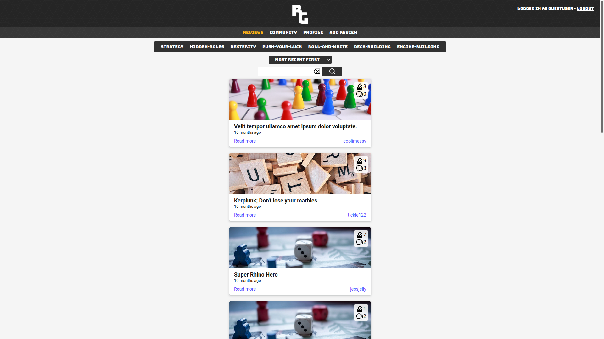

# Board games Front End

## [Live Link](https://compassionate-edison-7c69a7.netlify.app/)

**_Hosted on [netlify](https://www.netlify.com//)_**

## [Front-end repo](https://github.com/CtrlHoltDel/board-games-back-end)

## [Live API](https://chd-board-games.herokuapp.com/api)

## [API Repo](https://github.com/CtrlHoltDel/board-games-back-end)

# Overview

A front end to the aforementioned API. Created using React.

# Preview Images

## Desktop

<div align="center">



</div>

## Mobile

<div align="center">


</div>

## Main Tech Used

### React

A framework used to create dynamic front-end interfaces.

### React Router

Used to create a more recognisable and salient user experience.

### Axios

Used to simplify data fetching from the [back-end](https://github.com/CtrlHoltDel/board-games-back-end)

# Requirements

`node version 15.11.2`

# Creating your own local version

- Firstly clone the repo to your local machine.

`$ git clone https://github.com/CtrlHoltDel/board-games`

- Install dependencies

`$ npm install`

- If done succesfully you can now type `$npm start` into your terminal and it will load up a local server.

```Javascript

Compiled successfully!

You can now view board-games-front-end in the browser.

  Local:            http://localhost:3000
  On Your Network:  http://192.168.178.25:3000

Note that the development build is not optimized.
To create a production build, use npm run build.

```

Navigate to either `http://localhost:3000` or `http://192.168.178.25:3000` to see the app running locally.
